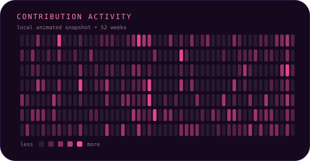

<div align="center">

<picture>
  <source media="(prefers-color-scheme: light)" srcset="./banner-light.svg">
  <source media="(prefers-color-scheme: dark)" srcset="./banner.svg">
  
</picture>

<br/>

<a href="https://github.com/syedahamedali2521">
  
</a>

### Think different. Build better. 🚀

<p>
  <a href="https://github.com/syedahamedali2521"></a>
  <a href="https://in.linkedin.com/in/syed-ahamed-ali"></a>
  <a href="mailto:ahamedalisyed8@gmail.com"></a>
</p>


</div>

---

## 👨‍💻 About Me

```python
class SyedAhamedAli:
    role = ["Python Developer", "Vibe Coder", "Frontend Developer"]
    focus = ["AI/ML", "NLP", "Generative AI", "Agentic AI"]
    philosophy = "Think different. Build better."

    def build(self):
        return "ideas → code → useful products"
```

- 🧠 Building with **Python, Machine Learning, Deep Learning, NLP, Generative AI & Agentic AI**
- 🛠️ Shipping interfaces with **React, JavaScript, Flask & Streamlit**
- 🔎 Working with **Pandas, Scikit-learn, BERT, BART, T5, Hugging Face, OpenCV & DeepFace**
- ⚙️ Automating workflows with **n8n + API integration**
- 💡 Fun mode: **vibe coding until the idea becomes a build**

## 🧰 Tech Stack

<p align="center">
  
  
  
  
  
  
  
  
  
  
  
  
  
  
  
  
  
  
</p>

## 📊 Local GitHub Cards

<div align="center">
  
  
</div>

<div align="center">
  
  
</div>

> **Note:** the cards above are local SVGs, so they do not depend on GitHub-readme-stats or other rate-limited card services. The activity card is a local visual snapshot rather than a live GitHub contribution API.

## 🚀 Featured Projects

| Project | Stack | What it does |
|---|---|---|
| [🎬 Movie Recommendation System](https://github.com/syedahamedali2521/movie_recommender) | Python · Scikit-learn · Pandas · NLP · Streamlit | Hybrid collaborative + content-based recommendation engine with an interactive UI. |
| [📝 Text Summarizer](https://github.com/syedahamedali2521/text_summarizer) | Python · BART/T5 · Transformers · Streamlit | Abstractive summarization pipeline with a clean Streamlit experience. |
| 🧩 All-in-One Web App Suite | React · JavaScript · APIs | A practical collection of web utilities and application flows built during web-development work. |
| 🤖 Agentic AI Interview Analyzer | Python · OpenCV · DeepFace · n8n | Multi-agent interview analysis concept combining visual/emotion signals with workflow automation. |

## 🏆 What I'm Building Toward

- 🤖 **Agentic AI systems** that turn multi-step ideas into useful workflows
- 🧠 **NLP + LLM applications** with better retrieval, summarization and automation
- 🌐 **AI-powered full-stack apps** that feel simple even when the backend is complex
- ⚡ **Developer automation** through APIs, n8n and reusable Python tooling

## 🐍 Contribution Snake

<div align="center">

<picture>
  <source media="(prefers-color-scheme: dark)" srcset="https://raw.githubusercontent.com/syedahamedali2521/syedahamedali2521/output/github-contribution-grid-snake-dark.svg">
  <source media="(prefers-color-scheme: light)" srcset="https://raw.githubusercontent.com/syedahamedali2521/syedahamedali2521/output/github-contribution-grid-snake.svg">
  
</picture>

</div>

## 🔗 Connect

<p align="center">
  <a href="https://github.com/syedahamedali2521"></a>
  <a href="https://in.linkedin.com/in/syed-ahamed-ali"></a>
  <a href="mailto:ahamedalisyed8@gmail.com"></a>
</p>

<div align="center">

### 💭 `Think different. Build better.`

<sub>Made with Python, SVG, SMIL, curiosity, and a lot of coffee.</sub>

</div>
